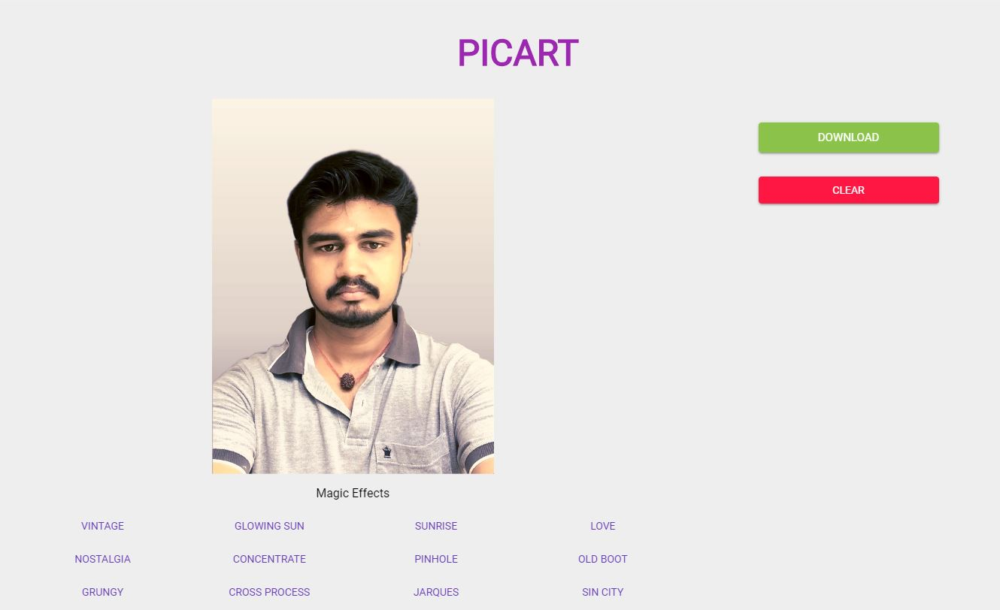

<div align="center">
<br>


</div>

<br>

<p align="center">
A handy image editor powered by electron.
</p>

<div align="center">
<br>


</div>

<br>

<div align="center">

<a href="https://facebook.github.io/react/"></a>
<a href="https://webpack.github.io/"></a>
<a href="http://redux.js.org/"></a>

</div>

<hr>
<br>

<div align="center">



</div>

## Run

Start the app in the `dev` environment. This starts the renderer process in [**hot-module-replacement**](https://webpack.js.org/guides/hmr-react/) mode and starts a webpack dev server that sends hot updates to the renderer process:

```bash
$ yarn dev
```

Alternatively, you can run the renderer and main processes separately. This way, you can restart one process without waiting for the other. Run these two commands **simultaneously** in different console tabs:

```bash
$ yarn start-renderer-dev
$ yarn start-main-dev
```

If you don't need autofocus when your files was changed, then run `dev` with env `START_MINIMIZED=true`:

```bash
$ START_MINIMIZED=true yarn dev
```

## Packaging

To package apps for the local platform:

```bash
$ yarn package
```

To package apps for all platforms:

First, refer to [Multi Platform Build](https://www.electron.build/multi-platform-build) for dependencies.

Then,

```bash
$ yarn package-all
```

To package apps with options:

```bash
$ yarn package -- --[option]
```

:bulb: You can debug your production build with devtools by simply setting the `DEBUG_PROD` env variable:

```bash
DEBUG_PROD=true yarn package
```

⚠️ Please read the following section before installing any dependencies ⚠️

### Module Structure

This app uses a [two package.json structure](https://github.com/electron-userland/electron-builder/wiki/Two-package.json-Structure). This means, you will have two `package.json` files.

1. `./package.json` in the root of your project
1. `./app/package.json` inside `app` folder

### Which `package.json` file to use

**Rule of thumb** is: all modules go into `./package.json` except native modules, or modules with native dependencies or peer dependencies. Native modules, or packages with native dependencies should go into `./app/package.json`.

1. If the module is native to a platform (like node-postgres), it should be listed under `dependencies` in `./app/package.json`
2. If a module is `import`ed by another module, include it in `dependencies` in `./package.json`. See [this ESLint rule](https://github.com/benmosher/eslint-plugin-import/blob/master/docs/rules/no-extraneous-dependencies.md). Examples of such modules are `material-ui`, `redux-form`, and `moment`.
3. Otherwise, modules used for building, testing and debugging should be included in `devDependencies` in `./package.json`.

<hr>

Apache License 2.0 © [Bharathvaj Ganesan](https://bharathvajganesan.me)
